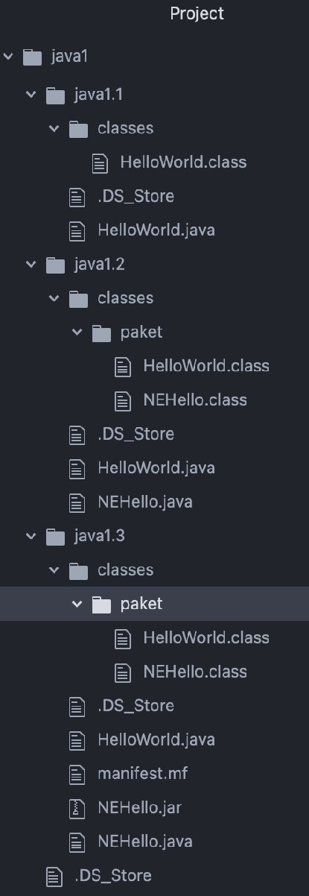
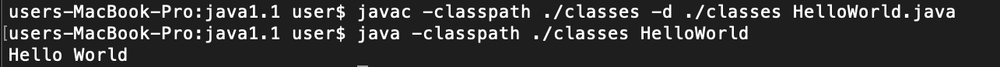
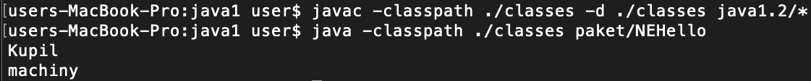
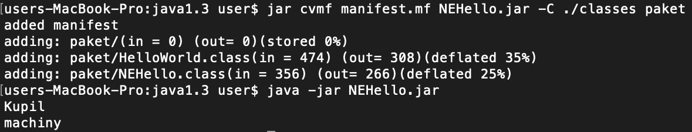

= Отчет по лабораторной работе 1

По дисциплине "Современные технологии промышленной разработки программного обеспечения"

Студент группы ИВМ-22: Кузнецов М. А.

:toc-title: Содержание
:toc:
:listing-caption: Листинг
:source-highlighter: rouge

== 1 Постановка задачи
В процессе выполнения лабораторной работы необходимо выполнить следующие задачи:

. Создать исполняемый java класс, который выводит текстовую строку на экран
. Разработать два класса. Первый класс вызывает 2 метода из второго класса (статический и нестатический)
. Создать jar-файл, хранящий элементы из предыдущего задания

== 2 Разработка задачи
=== 2.1 Структура проекта
Структура проекта:

== 3 Информация о реализации
=== 3.1 Задание 1
.Листинг класса HelloWorld
[source,java]
----
public class HelloWorld{
  public static void main(String args[]){
    System.out.println("Hello World");
  }
}
----

Для изменения рабочего католога использовалась команда cd в командной строке

.Команда cd
----
cd /Users/user/Desktop/ru/rsatu/java1/java1.1
----

Для компиляции файла использовалась команда javac в командной строке

.Команда javac
----
javac -classpath ./classes -d ./classes HelloWorld.java
----

Для запуска файла в командной строке использовалась команда java.

.Команда java
----
java -classpath ./classes HelloWorld
----
При запуске скомпилированного файла в командной строке выводится строка "Hello World".

=== 3.2 Задание 2
.Листинг класса HelloWorld
[source,java]
----
package paket;

public class HelloWorld{

  public static void nach(){
    System.out.println("Kupil");
  }
  public void machine(){
    System.out.println("machiny");
  }
}
----
.Листинг класса NEHello
[source,java]
----
package paket;
import paket.HelloWorld;
public class NEHello{
  public static void main(String args[]){
    HelloWorld obj = new HelloWorld();
    HelloWorld.nach();
    obj.machine();
  }
}
----
Для компиляции файлов использовалась команда javac в командной строке

.Команда javac
----
javac -classpath ./classes -d ./classes java1.2/*
----

Для запуска файла NEHello в командной строке использовалась команда java.

.Команда java
----
java -classpath ./classes paket/NEHello
----
При запуске в командной строке выводятся строки
----
"Kupil"
"machiny"
----

=== 3.3 Задание 3
Для создания архива был создан файл manifest.mf:

.Листинг manifest.mf
----
Manifest-Version: 1.0
Created-By: 1.6.0_19 (Sun Microsystem Inc.)
Main-Class: paket.NEHello

----

.Команда по сборке архива
----
jar cvmf manifest.mf NEHello.jar -C ./classes paket
----

.Команда запуска jar-файла
----
java -jar NEHello.jar
----

== 4 Результаты выполнения
В результате выполнения первого задания был получен класс HelloWorld. При запуске выводится строка:

В результате выполнения второго задания были получены классы HelloWorld и NEHello. При запуске выводятся строки:

В результате выполнения третьего задания был получен jar-файл NEHello. При запуске jar-файла выводятся строки:

== 5 Вывод
В процессе выполнения лабораторной работы были получены навыки компиляции классов в байт-код с помощью команды javac, запуска проектов с помощью команды java, создания jar-файлов, используя команду jar.
